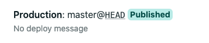
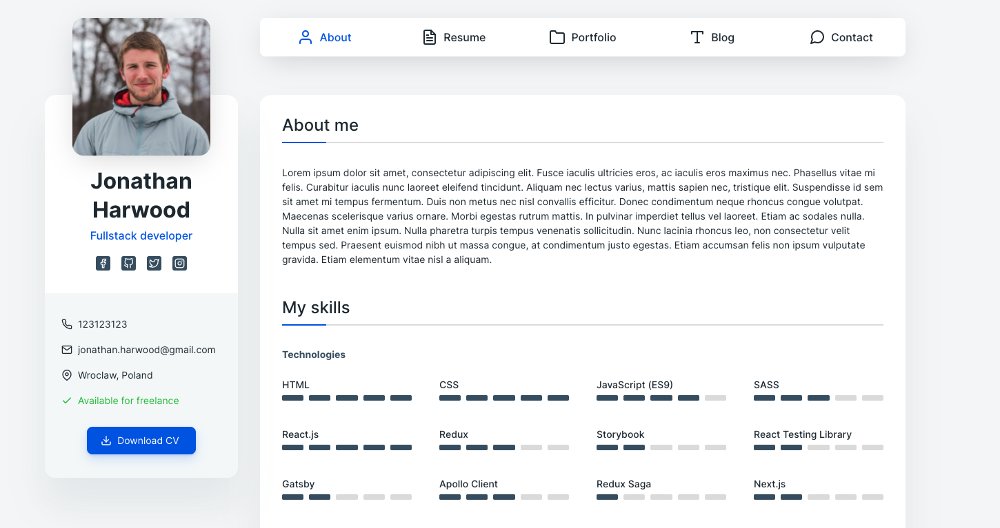
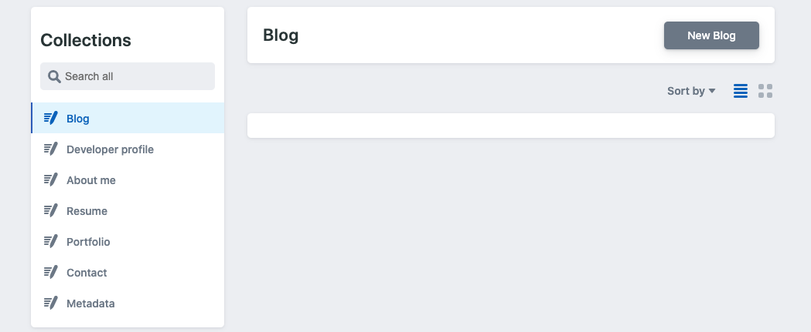
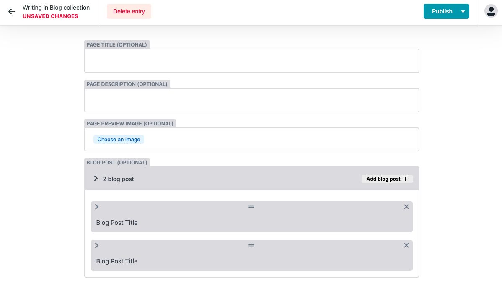
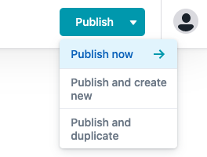
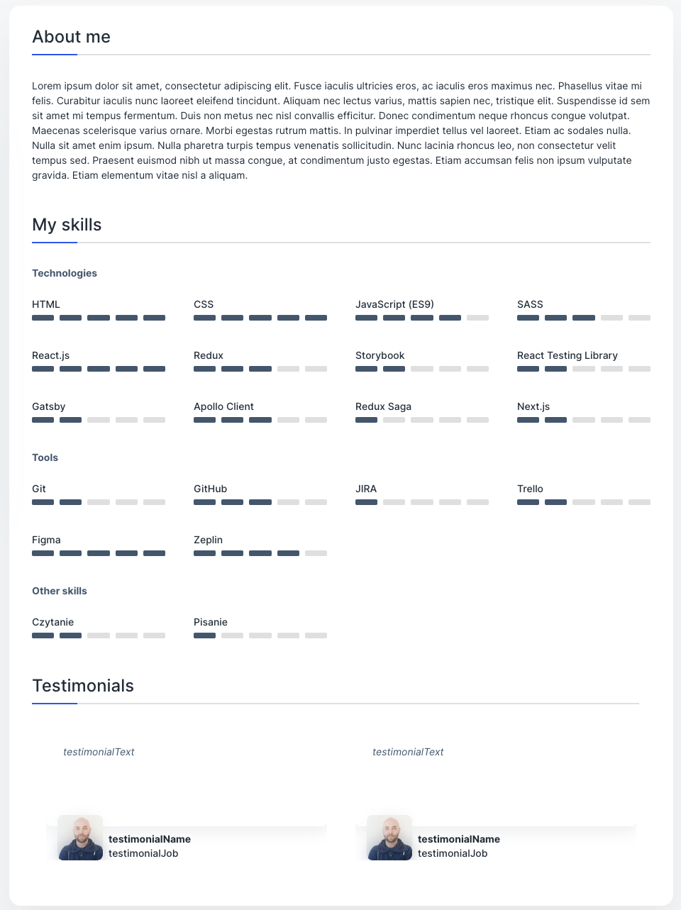
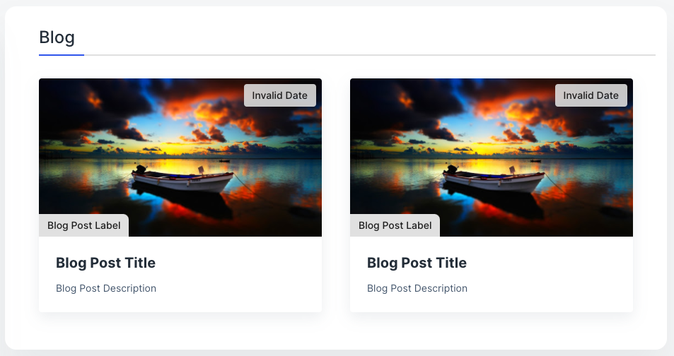
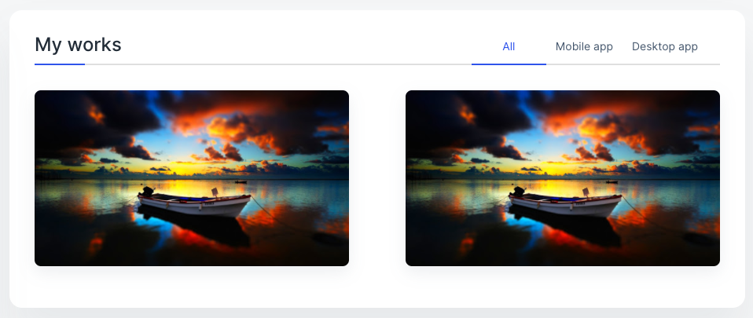
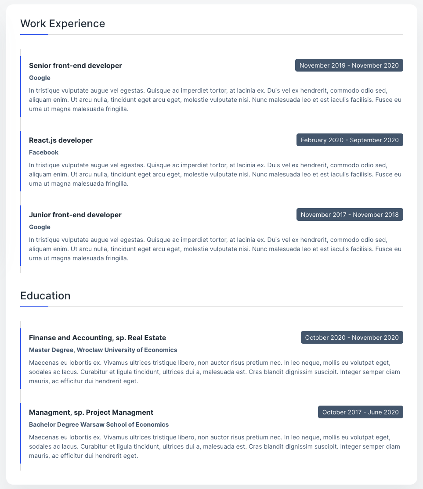

# Setup guide

This documentation will walk you through setting up a portfolio website with CodersCard project.

## Prerequisites

- [GitHub account](https://github.com/join)
- [Netlify account](https://app.netlify.com/signup) - you can login with GitHub

## Setup

1. Fork [CodersCard](https://github.com/CodersCrew/CodersCard) to your account.

2. Go to [your Netlify account](https://app.netlify.com/) and click on the **New site from Git** button.

3. Complete a quick 3-step process to setup your website.

- Choose GiHub for Continuous Development, then Authorize Netlify and it will get you to the second step.

- Click **Configure Netlify on GitHub** button, it will walk you throught installing Netlify app on GitHub. Install it on your account with the option for *Only selected repositories*, and select the `your-github-name`/CodersCard repository, it will get you back to Netlify website.

- Click on the **CodersCard** button on Netlify and it will get you to the third step.

- The default config is just fine so you can click the **Deploy site** button!

4. That's it, your site is being deployed! 🎉

The deploy can take a couple of minutes, please wait patiently and once it is done, it will change its status to **published**.

5. Click on the published version, and then click on the **Preview deploy** text to navigate to your newly published website. You will find out that the website is up and running, now it's time to add your own content to it!

## Populate website with content

After you finished the Setup section, you can now populate the website with your own content.
In order to do so, you have to complete the following steps.

1. Navigate to **Site settings** and select the **Identity** tab.

2. Scroll all the way to the bottom, where you find the **Services** section, there click **Enable Git Gateway**

3. Open up your newly hosted website again and navigate to `/admin` route on your website.
Wait a couple of seconds, it will take some time to initialize. Once it is ready, press the **Login with Netlify Identity** button.

4. You will have to Sign up, it is quick and you have to do it only once. After you sign up, you will get a confirmation email, click the confirmation link in the email. It will get you to the CMS where you will populate the website with your content.

5. Now you should be logged in and see something that looks as follows:

As you can see, there are 7 collections, **Blog** collection is optional and the rest are obligatory.

Now, click on the big, empty rectangle on the blog tab, it will get you to the blog collection where you can add the data to your blog. If you don't want to have a Blog page on your website, navigate to blog collection and remove the predefined blog posts with the `x` icon. If there are no blog posts, the blog page will not be included in your portfolio.

Now go through all the collections and replace the predefined information with your real information that you want to have included on your website. After you are done filling in information in any of the 7 collections, remember to press the **Publish** button and then the **Publish now ->** option, this will trigger another build of your website and in a couple of minutes, it will be populated with new data.

On these pictures below, you can find about what each collection represents on the website.

### Developer profile

### About me

### Blog

### Portfolio

### Resume

### Contact

Contact collection has only fields for metadata, it is not visible to the user on the website.

### Metadata

This is a special collection. While filling in your information, you could have noticed that it is possible to specify metadata per page, but these fields were optional. If you didn't specify metada per page, here is a obligatory portion of metadata that has to be specified, and will be applied to every page as a fallback.

After you fill in all your information, and publish your changes every time, you should see that your website has been updated, and you have your own, custom, portfolio website! 🎉
